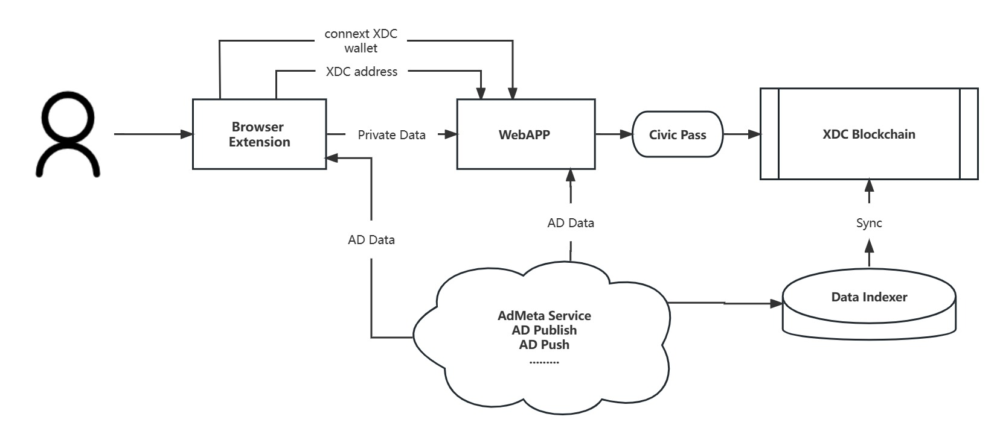

### AdMeta x XDC x Civic

# Project Introduction
The product we make is a Web3 advertising platform. First, there is a Chrome extension statistical data, and then the data is sent to the web to calculate and generate portraits, and then pass the Civic certification. Call the contract to match the user with an advertisement.



# Project Show
Open `/extension` 
```shell
yarn
yarn build
```
Open chrome://extensions/ and install extension.
Agree to use agreement, will open web dapp[AdMeta x XDC](https://xdc.admeta.network/)


# License
GPLv3
